# WDProjMagnesiumPradoRara
## A Thorough Review on Greek Mythology
#### LOGO: 
#### 
### DESCRIPTION: 
### Our webpage aims to rekindle the readers’ interests in the legends of Greek mythology. Our content involves backstories and interesting details about the Greeks and the gods that they believe in. Included in the website are maps and games that allow users to learn about the Greek civilization and their beliefs better. Our group believes that the culture of the ancient Greek civilization is still prominent even during the Contemporary period. 
******
### WEBPAGE BREAKDOWN:
### Home Page: Menu that will show links that will lead to the other webpages.
### W1 (Olympians): This webpage will talk about the twelve Olympians of Greek mythology. The webpage will also include a brief description and history of each Olympian.
### W2 (Famous Heroes): This webpage will talk about some of the many known heroes and monsters in Greek mythology. Each hero or monster will have his/her own brief description and history on how he/she came to be well-known.
### W3 (Interactive Map of Greece): This webpage will involve an interactive map using JavaScript, designed to show the user a description of the important events and landmarks that are present in the area of the map that the user clicks on.
### W4 (Gallery): This webpage will showcase different artworks dedicated to the Greeks, while referencing Greek mythology. The general interpretation of the artworks will also be displayed with the art itself.
### W5 (Text RPG): This webpage is a game developed by our group involving the use of JavaScript. The game involves the user making decisions based on scenarios taken from Greek mythology. The user will also encounter different characters, mentioned in our other webpages, who will either guide the user or test the survival skills of the user.
### W6 (Sources): This part of our website contains links, references, and other websites used for the creation of this website.
******
### JavaScript Incorporation: We will use JavaScript in the Map and Game webpage of our website. For the Map webpage, the user will have to press a location on the Map of Greece specified by a marker. JavaScript will take that input and release an output on the description part of the page. It works similar to an array. 
### For the Game webpage, the user will have to select between options which can either benefit or downgrade the user's character. Basically, the JavaScript to be used here is of selection structures, where if the user selects an option, it will lead the user to a different branch of if else conditions.
******
### WIREFRAMES: 
#### Home Page: 
#### 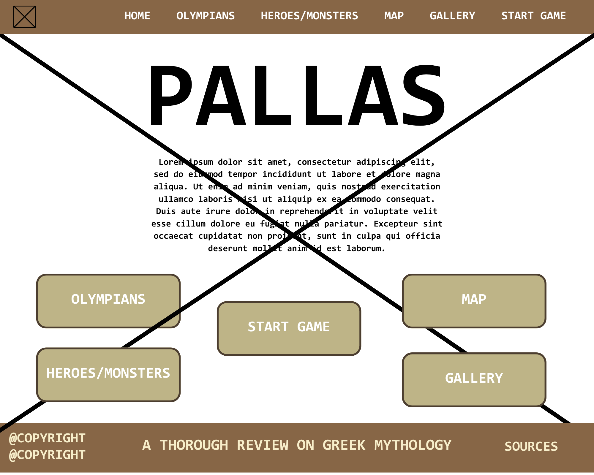 
#### Olympians: 
#### 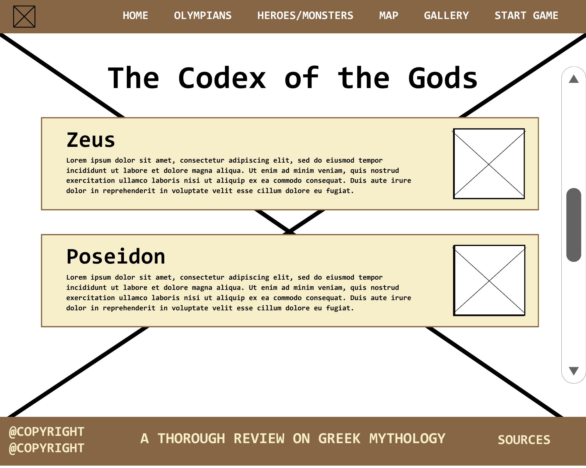
#### Heroes/Monsters:
#### 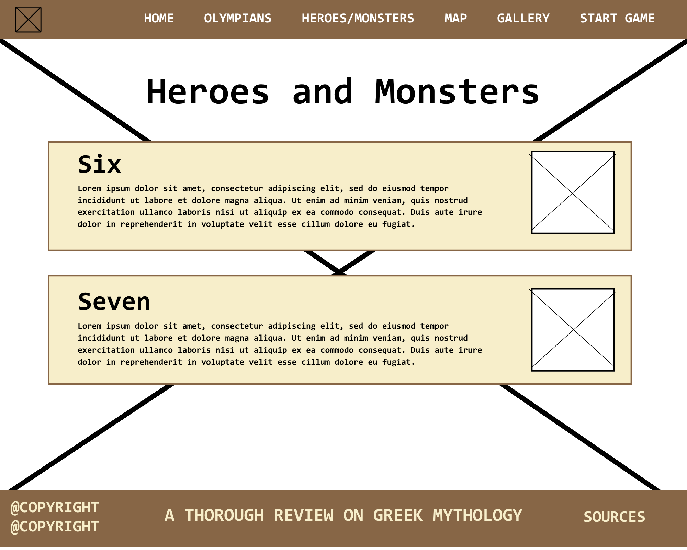
#### Map:
#### 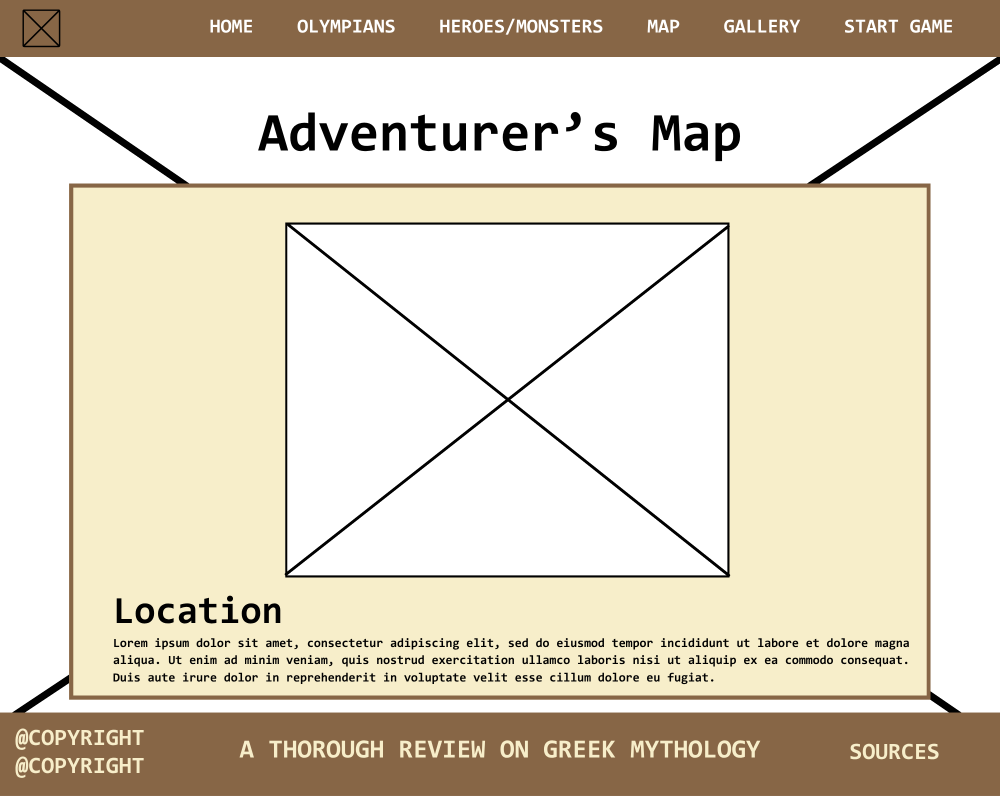
#### Gallery:
#### 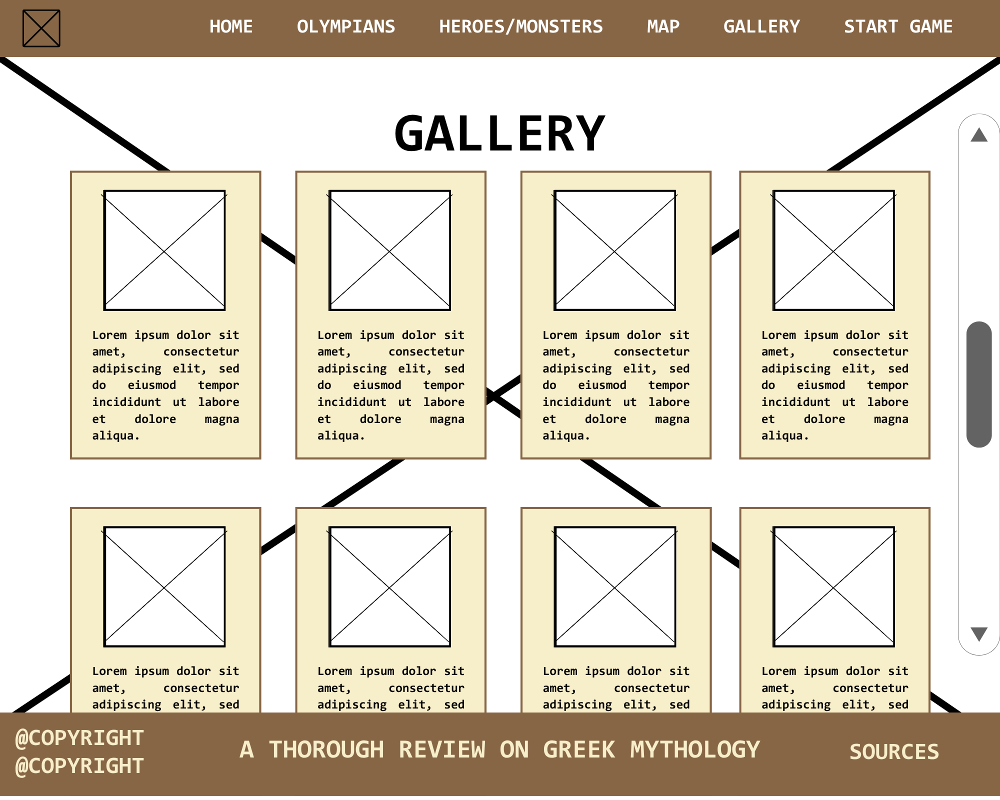
#### Gallery (Expanded): 
#### 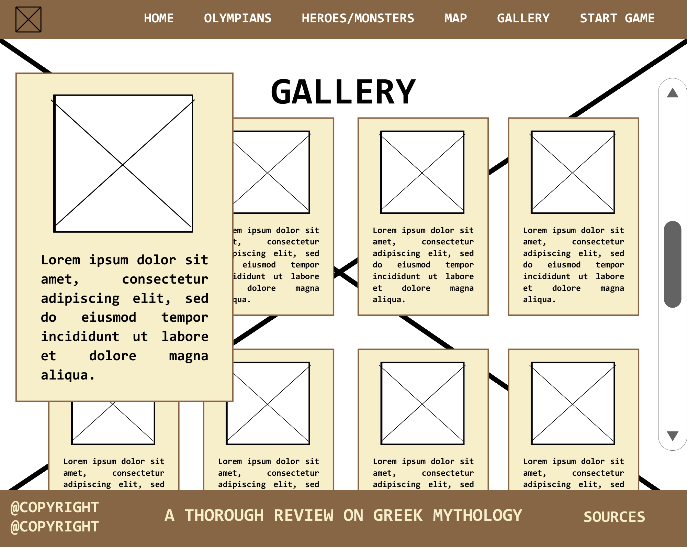
#### Game: 
#### 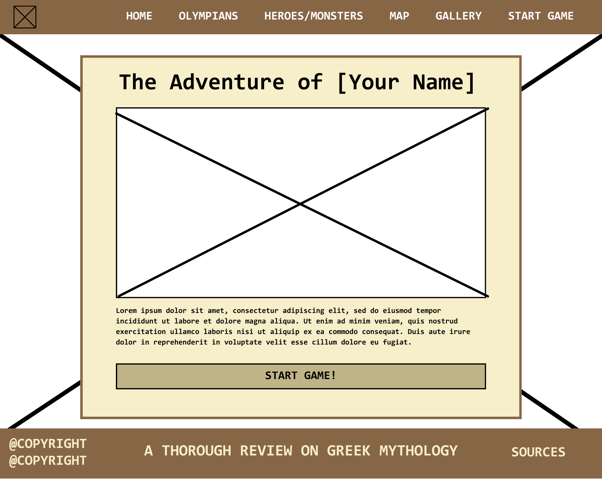
#### Game (Expanded):
#### 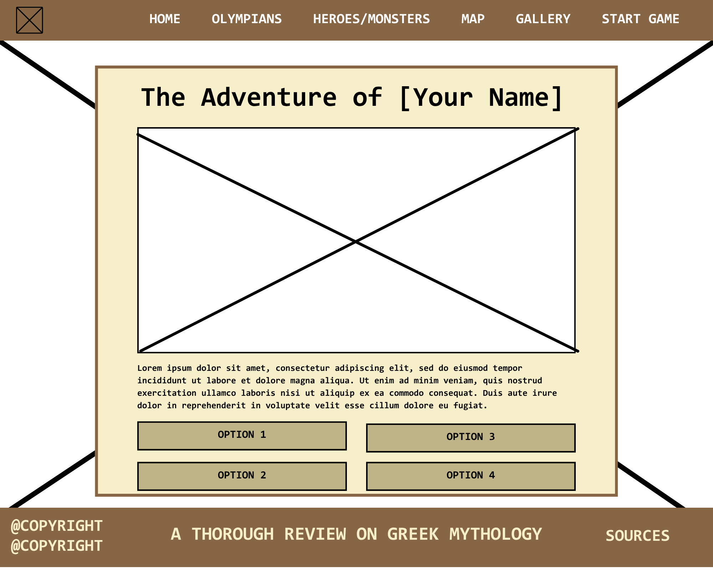
#### Sources: 
#### 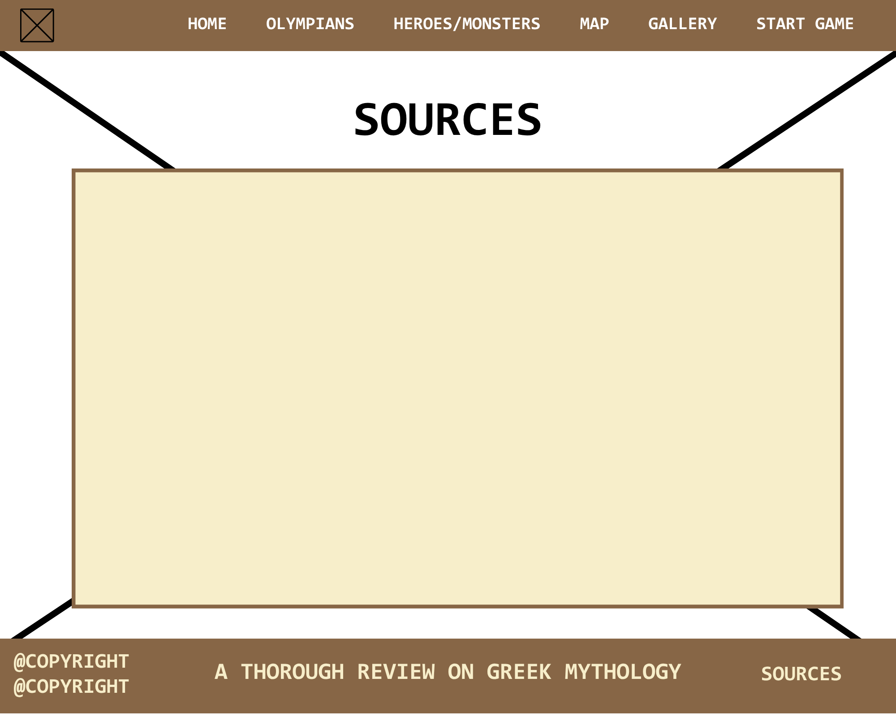
******
## Third Quarter Updated Project Proposal
### DESCRIPTION: 
### This update for our 2nd Quarter Website Project introduces a more interactive kind of webpage that lets the user fill in personal information related to personality and character-like traits. The user simply provides answers to specific questions regarding his/her personality. After answering, the user has the freedom to look at which Greek god/hero (one webpage for the similar god and one webpage for similar hero) is closest to him/her in terms of personality and traits. The user also has the freedom to choose whether to save the data of the quiz or not.

### These new webpages allow the user to understand important figures of Greek mythology. It allows them to personally connect with the character associated to him/her, understanding the story and their importance in the mythical world of Greece. The webpages with the associated god or hero is saved even after closing the website. In case the user wants to save NEW data, the browser asks the user if he/she wants to delete the previously saved data first.
******
### WIREFRAMES: 
#### Personality Quiz: 
#### 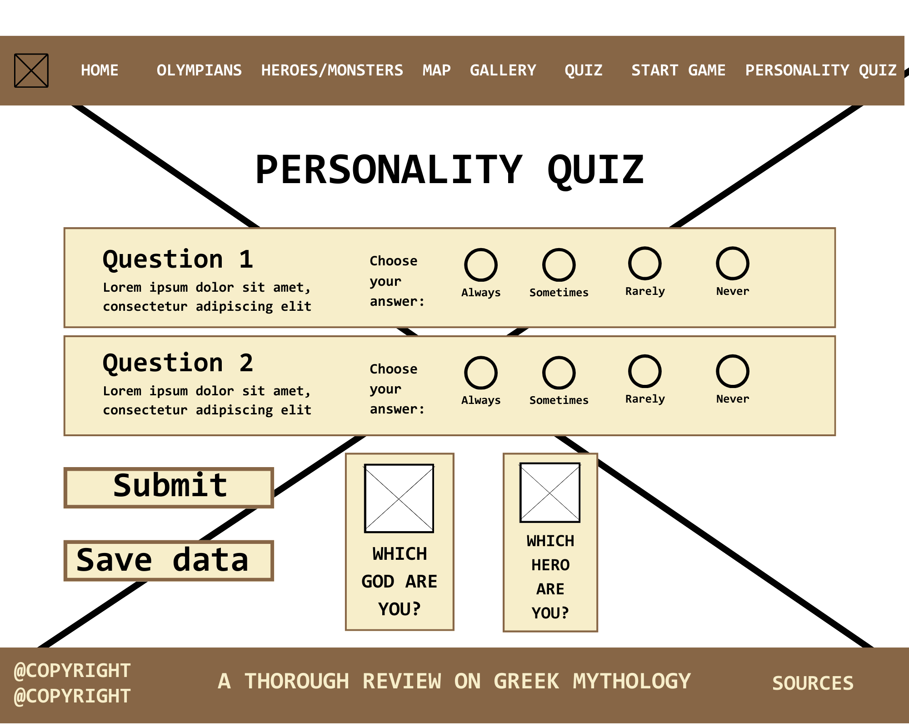 
#### God Profile: 
#### 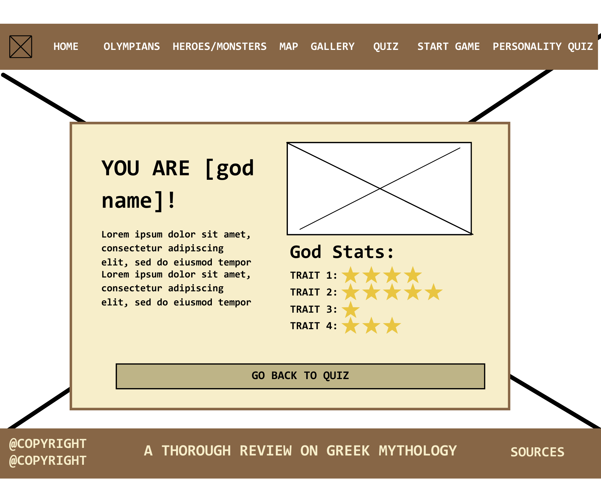
#### Hero Profile:
#### 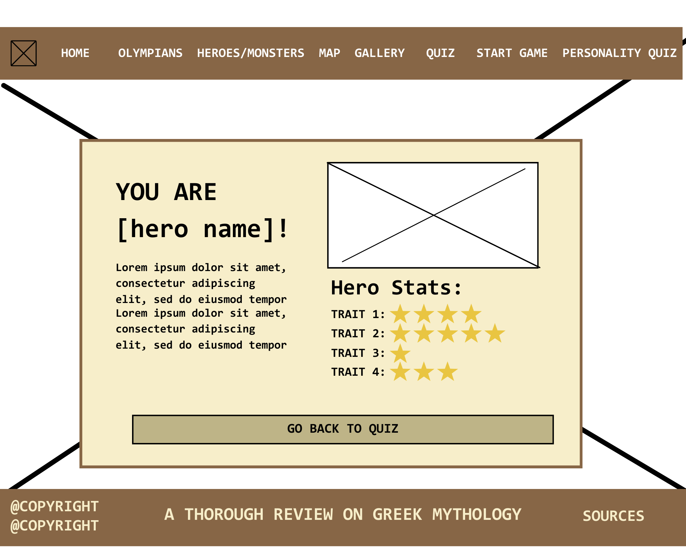